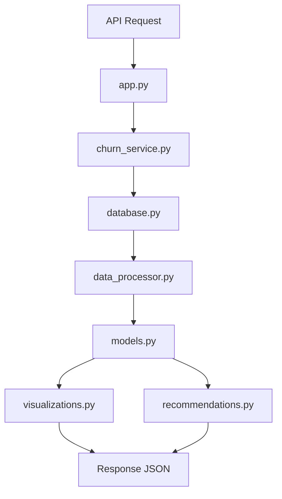

# Arquitectura de la API de Análisis de Churn

## 📋 Visión General

La API está diseñada con una arquitectura modular que separa claramente las responsabilidades y facilita el mantenimiento y escalabilidad del código.

## 🏗️ Estructura de Módulos

### 1. `app.py` - API Principal
**Responsabilidad**: Punto de entrada de la aplicación Flask
- Define todos los endpoints REST
- Maneja errores HTTP
- Orquesta las llamadas al servicio principal
- Configuración mínima y limpia

### 2. `config.py` - Configuración Centralizada
**Responsabilidad**: Gestión de configuración
- Variables de entorno
- Configuración de base de datos
- Parámetros de modelos ML
- Configuración de visualizaciones

### 3. `database.py` - Gestión de Base de Datos
**Responsabilidad**: Acceso a datos
- Conexiones a PostgreSQL
- Consultas SQL optimizadas
- Extracción de datos del data warehouse
- Manejo de errores de conexión

### 4. `data_processor.py` - Procesamiento de Datos
**Responsabilidad**: Transformación de datos
- Limpieza y preparación de datos
- Creación de características derivadas
- Manejo de valores nulos
- Escalado y normalización

### 5. `models.py` - Modelos de Machine Learning
**Responsabilidad**: Algoritmos predictivos
- Modelo de churn (RandomForest)
- Modelo de predicción futura (MultiOutput)
- Entrenamiento y evaluación
- Diagnóstico de modelos

### 6. `visualizations.py` - Generación de Gráficos
**Responsabilidad**: Visualizaciones
- Gráficos de predicciones futuras
- Distribuciones de churn
- Importancia de características
- Conversión a base64

### 7. `recommendations.py` - Motor de Recomendaciones
**Responsabilidad**: Lógica de negocio
- Generación de recomendaciones personalizadas
- Clasificación por nivel de riesgo
- Reportes de resumen
- Exportación de datos

### 8. `churn_service.py` - Servicio Principal
**Responsabilidad**: Orquestación
- Coordina todos los módulos
- Flujo completo de análisis
- Gestión de estado
- API interna para endpoints

## 🔄 Flujo de Datos



## 📊 Flujo del Análisis Completo

### Paso 1: Extracción de Datos
```python
database.py → get_user_data()
```
- Consulta SQL compleja al data warehouse
- Extracción de métricas de usuario
- Cálculo de churn con lógica de negocio

### Paso 2: Procesamiento
```python
data_processor.py → prepare_features_ultra_conservative()
```
- Limpieza de datos
- Creación de características derivadas
- Eliminación de data leakage
- Selección de características seguras

### Paso 3: Entrenamiento de Modelo de Churn
```python
models.py → ChurnModel.train_ultra_conservative_model()
```
- RandomForest con parámetros conservadores
- Validación cruzada
- Métricas de evaluación (ROC AUC, PR AUC)

### Paso 4: Entrenamiento de Modelo Futuro
```python
models.py → FuturePredictionModel.train_model()
```
- Creación de secuencias temporales
- MultiOutput RandomForest Regressor
- Predicción de 15 días futuros

### Paso 5: Generación de Predicciones
```python
models.py → predict_future_behavior()
```
- Predicciones por usuario y día
- Cálculo de riesgo de churn
- Niveles de engagement

### Paso 6: Recomendaciones
```python
recommendations.py → generate_intervention_recommendations()
```
- Análisis de riesgo por usuario
- Recomendaciones personalizadas
- Clasificación por urgencia

### Paso 7: Visualizaciones
```python
visualizations.py → generate_all_visualizations()
```
- Gráficos de predicciones futuras
- Distribuciones de riesgo
- Rendimiento del modelo
- Conversión a base64

## 🔧 Patrones de Diseño Utilizados

### 1. Service Layer Pattern
- `churn_service.py` actúa como capa de servicio
- Encapsula la lógica de negocio compleja
- Proporciona una interfaz limpia para la API

### 2. Repository Pattern
- `database.py` actúa como repositorio
- Abstrae el acceso a datos
- Facilita testing y cambios de BD

### 3. Strategy Pattern
- Diferentes estrategias de procesamiento de datos
- Múltiples algoritmos de recomendación
- Flexibilidad en configuración

### 4. Factory Pattern
- Creación de modelos ML
- Generación de visualizaciones
- Configuración dinámica

## 🚀 Ventajas de la Arquitectura

### Mantenibilidad
- Código organizado por responsabilidades
- Fácil localización de bugs
- Modificaciones aisladas

### Escalabilidad
- Módulos independientes
- Fácil adición de nuevas funcionalidades
- Posibilidad de microservicios

### Testabilidad
- Cada módulo es testeable independientemente
- Mocking simplificado
- Cobertura de código clara

### Reutilización
- Módulos reutilizables en otros proyectos
- API interna bien definida
- Separación clara de concerns

## 🔒 Consideraciones de Seguridad

### Validación de Entrada
- Validación en `app.py`
- Sanitización en `data_processor.py`
- Manejo seguro de errores

### Gestión de Conexiones
- Pool de conexiones en `database.py`
- Timeout configurables
- Manejo de reconexión

### Logging y Monitoreo
- Logs estructurados por módulo
- Métricas de rendimiento
- Alertas de errores

## 📈 Métricas y Monitoreo

### Métricas de Negocio
- Tasa de churn predicha
- Precisión del modelo
- Usuarios de alto riesgo

### Métricas Técnicas
- Tiempo de respuesta por endpoint
- Uso de memoria
- Conexiones a BD

### Alertas
- Fallos de conexión a BD
- Degradación del modelo
- Errores de procesamiento

## 🔄 Ciclo de Desarrollo

### 1. Desarrollo Local
```bash
python start.py  # Verificaciones + inicio
python test_api.py  # Pruebas completas
```

### 2. Testing
- Tests unitarios por módulo
- Tests de integración
- Tests de carga

### 3. Deployment
- Containerización con Docker
- Variables de entorno
- Health checks

## 📚 Extensibilidad

### Nuevos Modelos
1. Crear clase en `models.py`
2. Integrar en `churn_service.py`
3. Añadir endpoint en `app.py`

### Nuevas Visualizaciones
1. Método en `visualizations.py`
2. Integrar en `generate_all_visualizations()`
3. Documentar en API

### Nuevas Fuentes de Datos
1. Métodos en `database.py`
2. Procesamiento en `data_processor.py`
3. Configuración en `config.py`

Esta arquitectura modular garantiza que el código sea mantenible, escalable y fácil de entender, siguiendo las mejores prácticas de desarrollo de software.